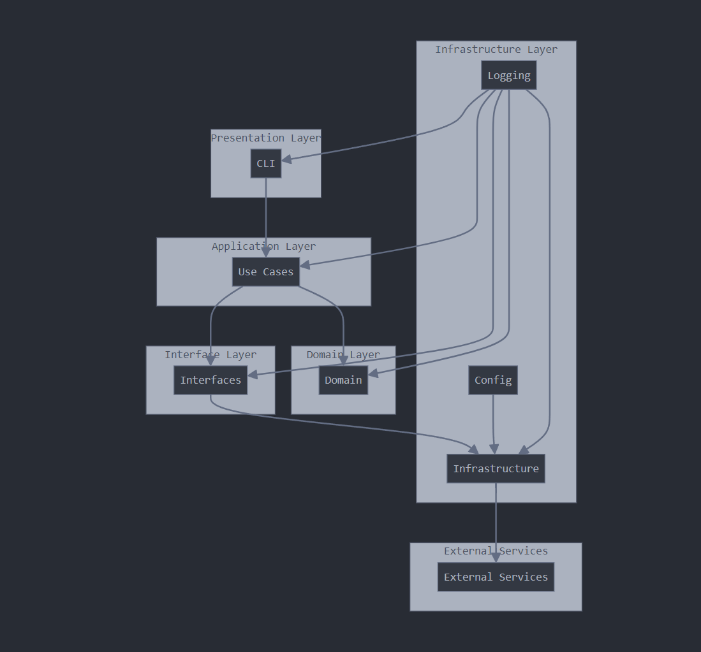

# Automator

Automator is a Python application that allows users to generate and post tweets using OpenAI's GPT model and the Twitter API.

## Features

- Generate tweet content using OpenAI's GPT model
- Post tweets to Twitter
- Command-line interface for easy interaction
- Robust error handling and logging

## System Architecture

The application follows a clean architecture pattern, divided into the following layers:

1. Presentation Layer (CLI)
2. Application Layer (Use Cases)
3. Domain Layer (Entities)
4. Interface Layer (Gateways)
5. Infrastructure Layer (External APIs, Logging, Configuration)



## Installation

1. Clone the repository:
   ```
   git clone https://github.com/yourusername/automator.git
   cd automator
   ```

2. Create a virtual environment and activate it:
   ```
   python -m venv .venv
   source .venv/bin/activate  # On Windows, use `.venv\Scripts\activate`
   ```

3. Install the required packages:
   ```
   pip install -r requirements.txt
   ```

4. Set up your environment variables:
   Create a `.env` file in the root directory and add the following:
   ```
   CONSUMER_KEY=your_twitter_consumer_key
   CONSUMER_SECRET=your_twitter_consumer_secret
   ACCESS_TOKEN=your_twitter_access_token
   ACCESS_TOKEN_SECRET=your_twitter_access_token_secret
   OPENAI_API_KEY=your_openai_api_key
   ```

## Usage

Run the application using the following command:

```
python main.py
```

Follow the prompts to generate and post tweets.

## Project Structure

```
automator/
├── .venv/
├── docs/
│   └── Automator_System_Architecture.png
├── resources/
│   └── prompts/
│       └── techaware_pro_prompt_for_x.txt
├── src/
│   ├── domain/
│   │   ├── entities/
│   │   │   ├── __init__.py
│   │   │   └── tweet.py
│   │   ├── __init__.py
│   │   └── exceptions.py
│   ├── infrastructure/
│   │   ├── config/
│   │   │   ├── __init__.py
│   │   │   ├── environment.py
│   │   │   ├── environment_openai.py
│   │   │   └── environment_twitter.py
│   │   ├── external/
│   │   │   ├── __init__.py
│   │   │   ├── openai_api.py
│   │   │   └── twitter_api.py
│   │   ├── logging/
│   │   │   ├── __init__.py
│   │   │   └── logger.py
│   │   ├── utils/
│   │   │   ├── __init__.py
│   │   │   └── file_reader.py
│   │   └── __init__.py
│   ├── interfaces/
│   │   ├── __init__.py
│   │   ├── openai_gateway.py
│   │   └── twitter_gateway.py
│   ├── presentation/
│   │   ├── __init__.py
│   │   └── cli.py
│   ├── use_cases/
│   │   ├── __init__.py
│   │   ├── generate_tweet.py
│   │   └── post_tweet.py
│   └── __init__.py
├── tests/
│   ├── domain/
│   │   ├── entities/
│   │   │   ├── __init__.py
│   │   │   └── test_tweet.py
│   │   ├── __init__.py
│   │   └── test_exceptions.py
│   ├── infrastructure/
│   │   ├── config/
│   │   │   ├── __init__.py
│   │   │   ├── test_environment.py
│   │   │   ├── test_environment_openai.py
│   │   │   └── test_environment_twitter.py
│   │   ├── external/
│   │   │   ├── __init__.py
│   │   │   ├── test_openai_api.py
│   │   │   └── test_twitter_api.py
│   │   ├── logging/
│   │   │   ├── __init__.py
│   │   │   └── test_logger.py
│   │   └── __init__.py
│   ├── interfaces/
│   │   ├── __init__.py
│   │   ├── test_openai_gateway.py
│   │   └── test_twitter_gateway.py
│   ├── presentation/
│   │   ├── __init__.py
│   │   └── test_cli.py
│   └── use_cases/
│       ├── __init__.py
│       ├── test_generate_tweet.py
│       └── test_post_tweet.py
├── __init__.py
├── conftest.py
├── main.py
├── README.md
└── requirements.txt
```

## Contributing

Contributions are welcome! Please feel free to submit a Pull Request.

## License

This project is licensed under the MIT License.